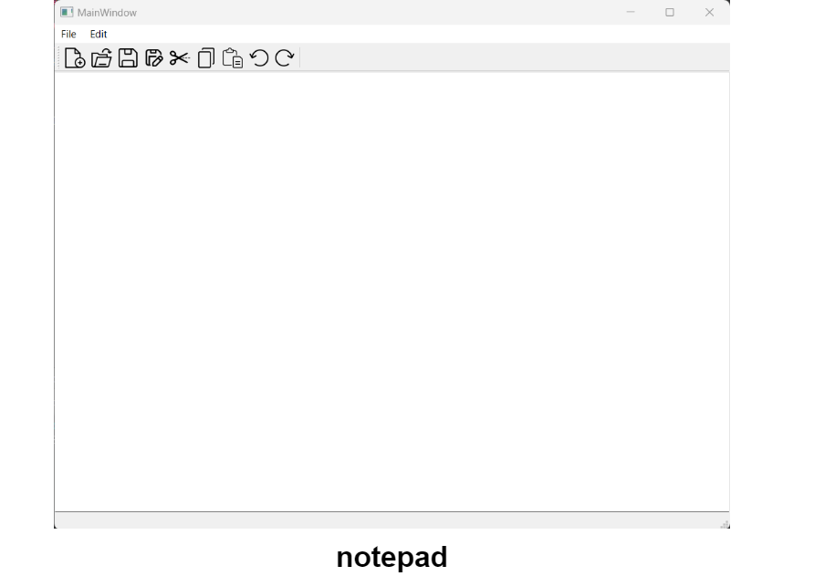

# Notepad App Using 
<a href="https://www.w3schools.com/cpp/" target="_blank" rel="noreferrer">  </a>

<!--  -->


### Demo Screeshots of Notepad


<h3>Tasks added</h3>

[Notepad](./ReadmeResources/MainWindow%202023-09-13%2000-46-11.mp4 "Notepad")
[Notepad](https://youtu.be/NJpD5nm8L9I "Notepad")
[](https://youtu.be/NJpD5nm8L9I)


<h3>Tasks deleted</https://youtu.be/NJpD5nm8L9Ih3>
<br>

to start the project 
<br>
step 1: install QT software
<br>
step 2: install kit in Qt 
<br>
step 3: open the project on Qt and then just use 
the run button 

<br>
then enjoy using the notepad 😃 🎊 
<br>
<br>

##  Tech Stacks

<a href="https://www.w3schools.com/cpp/" target="_blank" rel="noreferrer">  </a>
<br>


<!-- ## Folder Structure 

Folder structure of this project for your reference 

```
├── ASSETS
│   ├── profile-pic.png
│   ├── 
│   ├── 
│   ├── 
│   ├── 
│   ├── 
│   
├── CSS
│   ├── style.css
│   ├── 
│   ├── COLOR
│   │   |- color-1.css
│   │   |- color-2.css
│   │   |- color-3.css
│   │   |- color-4.css
|   ... |- style-switcher.css
│   
├── JS
│   ├── script.js   
|   ├── style-switcher.js
|
├── 
├──  
└── 
└── 
``` -->


<!-- ## Open Source 


##  Contributor
 


<a href="https://github.com/Rik-21/Profile-Website/graphs/contributors">
  
</a>


##  Project Admin

<a href="https://github.com/Rik-21">Rupantar Mondal</a>
<br>

##  Give this Project a Star

If you liked working on this project, do ⭐ and share this repository.

🎉 🎊 😃 Thanks for visiting 😃 🎊 🎉
<br>

##  Contact Me

If you want to contact me, you can reach me through github
 -->
 <br>
 <br>
 <br>
